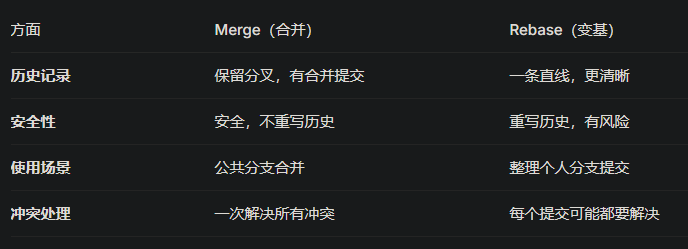

webpack 构建过程  
 读取配置 → 编译模块 → 生成依赖图 → 打包输出

loader 和 plugin 区别  
Loader = 文件转换器，把非 JS 文件（CSS/图片等）转成 JS 能处理的模块  
Plugin = Webpack 的功能扩展器，在构建过程的不同阶段插入自定义逻辑（生成 html 文件，压缩代码，打包分析等）

webpack 优化  
代码分割，tree-shaking，缓存，懒加载

vite  
启动快：开发环境不打包，利用原生 esmodule 按需编译文件  
开发环境 esbuild 构建，生产环境 rollup 构建

设计模式：

1. 发布订阅模式
2. 单例模式
3. 策略模式
4. 装饰器模式

git rebase:  
适用整理个人分支提交，把自己的分支接到主分支最新提交后面，保持线性历史，历史记录一条直线，不保留分叉

一个好组件该怎么设计？  
接口易用、易理解、内部高内聚、外部低耦合、可扩展、可测试、文档完善
